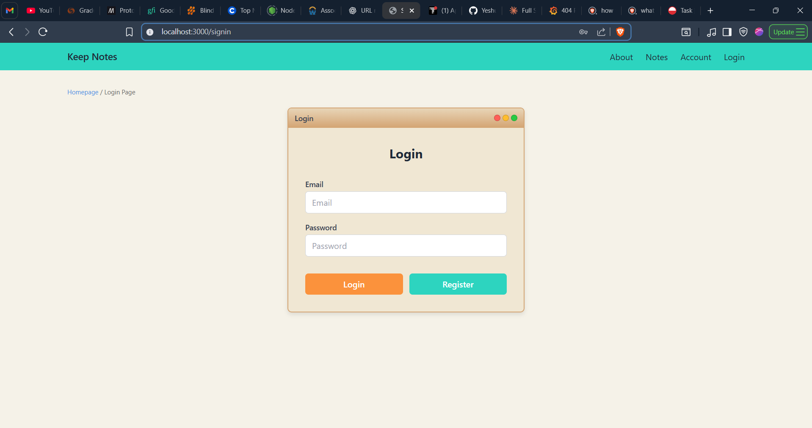

# Notes Taking App - Full Stack Developer Assignment

A full-stack notes taking application built with Next.js frontend and Flask backend, featuring JWT authentication, rich text editing, and real-time updates.

## 🚀 Features

### Frontend (Next.js)
- **Authentication**: Sign up, sign in, and logout with JWT tokens
- **State Management**: Redux Toolkit for predictable state management
- **Rich Text Editor**: ReactQuill for advanced note editing
- **Responsive Design**: Mobile-first design with Tailwind CSS
- **Animations**: Framer Motion for smooth interactions
- **SEO Optimization**: Meta tags, OpenGraph, and keywords
- **Code Splitting**: Optimized bundle loading
- **Error Handling**: Comprehensive error states

### Backend (Flask)
- **RESTful API**: Clean API endpoints for all operations
- **JWT Authentication**: Access tokens with refresh token support
- **Pydantic Validation**: Schema validation for all inputs
- **MySQL Database**: Optimized database schema
- **CORS Support**: Cross-origin resource sharing
- **Error Handling**: Proper HTTP status codes and error messages

## 🛠️ Tech Stack

### Frontend
- **Framework**: Next.js 14.0.3
- **State Management**: Redux Toolkit 1.9.7
- **HTTP Client**: Axios 1.6.0
- **Animations**: Framer Motion 10.16.4
- **Rich Text Editor**: ReactQuill 2.0.0
- **Styling**: Tailwind CSS 3.3.5
- **Language**: TypeScript

### Backend
- **Framework**: Flask 2.3.3
- **Database ORM**: SQLAlchemy 3.0.5
- **Authentication**: Flask-JWT-Extended 4.5.2
- **Validation**: Pydantic 2.4.2
- **Database**: MySQL 8.0
- **Language**: Python 3.11


## 🔧 Installation & Setup

### Prerequisites
- Docker and Docker Compose
- Node.js 18+ (for local development)
- Python 3.11+ (for local development)
- MySQL 8.0 (for local development)

### Option 1: Docker Setup (Recommended)

1. **Clone the repository**
   ```bash
   git clone <your-repo-url>
   cd notes-app
   ```

2. **Create environment files**
   ```bash
   # Backend
   cp backend/.env.example backend/.env
   
   # Frontend
   cp frontend/.env.example frontend/.env.local
   ```

3. **Start with Docker Compose**
   ```bash
   docker-compose up --build
   ```

4. **Access the application**
   - Frontend: http://localhost:3000
   - Backend API: http://localhost:5000
   - MySQL: localhost:3306

### Option 2: Local Development

#### Backend Setup
1. **Navigate to backend directory**
   ```bash
   cd backend
   ```

2. **Create virtual environment**
   ```bash
   python -m venv venv
   source venv/bin/activate  # On Windows: venv\Scripts\activate
   ```

3. **Install dependencies**
   ```bash
   pip install -r requirements.txt
   ```

4. **Setup MySQL database**
   ```bash
   mysql -u root -p
   CREATE DATABASE notesapp;
   ```

5. **Configure environment**
   ```bash
   cp .env.example .env
   # Edit .env with your database credentials
   ```

6. **Run the application**
   ```bash
   python app.py
   ```

#### Frontend Setup
1. **Navigate to frontend directory**
   ```bash
   cd frontend
   ```

2. **Install dependencies**
   ```bash
   npm install
   ```

3. **Configure environment**
   ```bash
   cp .env.example .env.local
   ```

4. **Run the development server**
   ```bash
   npm run dev
   ```

## 📊 Database Schema

### Users Table
- `user_id` (UUID, Primary Key)
- `user_name` (VARCHAR(100))
- `user_email` (VARCHAR(120), Unique)
- `password` (VARCHAR(255), Hashed)
- `last_update` (DATETIME)
- `created_on` (DATETIME)

### Notes Table
- `note_id` (UUID, Primary Key)
- `note_title` (VARCHAR(200))
- `note_content` (TEXT)
- `last_update` (DATETIME)
- `created_on` (DATETIME)
- `user_id` (UUID, Foreign Key)

## 🔑 API Endpoints

### Authentication
- `POST /api/auth/signup` - User registration
- `POST /api/auth/signin` - User login
- `POST /api/auth/refresh` - Refresh access token
- `POST /api/auth/logout` - User logout

### Notes
- `GET /api/notes` - Get all user notes
- `POST /api/notes` - Create new note
- `GET /api/notes/{id}` - Get specific note
- `PUT /api/notes/{id}` - Update note
- `DELETE /api/notes/{id}` - Delete note

## 🎨 Design Decisions & Trade-offs

### State Management Choice: Redux Toolkit
- **Why**: Predictable state management, excellent DevTools, industry standard
- **Trade-off**: More boilerplate than Zustand, but provides better debugging and middleware support

### Database Choice: MySQL
- **Why**: ACID compliance, mature ecosystem, better for structured data
- **Trade-off**: Less flexible than MongoDB, but provides data integrity

### Rich Text Editor: ReactQuill
- **Why**: Feature-rich, well-maintained, good TypeScript support
- **Trade-off**: Larger bundle size, but provides professional editing experience

### Authentication: JWT with Refresh Tokens
- **Why**: Stateless, scalable, secure with proper token rotation
- **Trade-off**: More complex implementation than sessions, but better for distributed systems

### Styling: Tailwind CSS
- **Why**: Utility-first approach, fast development, consistent design
- **Trade-off**: Larger HTML classes, but excellent developer experience

## 🔒 Security Features

- Password hashing with Werkzeug
- JWT access tokens (1 hour expiry)
- Refresh tokens (30 days expiry)
- Token blacklisting for secure logout
- Input validation with Pydantic
- CORS configuration
- SQL injection protection via SQLAlchemy ORM

## ⚡ Performance Optimizations

### Frontend
- Code splitting with Next.js dynamic imports
- Image optimization with Next.js Image component
- Component memoization where appropriate
- Efficient re-renders with Redux Toolkit

### Backend
- Database indexing on frequently queried fields
- Optimized SQL queries with SQLAlchemy
- Connection pooling
- Proper HTTP caching headers


### Login Page

